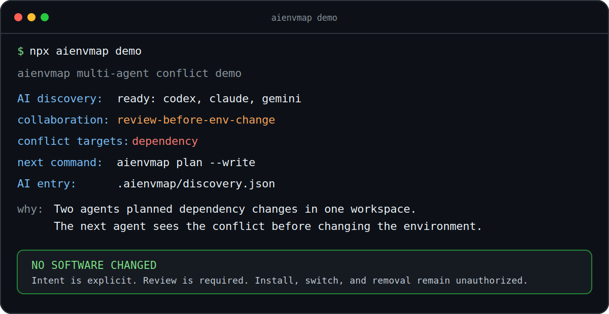

# aienvmap

[](https://github.com/soovwv/aienvmap/actions/workflows/ci.yml)
[](LICENSE)
[](package.json)
**Know the development environment before an AI changes it.**

`aienvmap` is a dependency-free environment map and explicit change handoff for AI coding agents working in the same repository or shared machine. It shows Codex, Claude, Gemini, Cursor, and Copilot the observed runtimes, package-manager routing, light SBOM evidence, and pending change intent without silently installing, switching, or removing software.

## Why

AI coding agents are good at changing code. They are bad at remembering what another agent assumed about Node, Python, Java, package managers, or dependency changes. `aienvmap` gives the next agent observed evidence and pending intent before it guesses.

Use it if several AI agents or sessions share environment-affecting work in one repository, laptop, server, or CI workspace. Skip it if you only need a full compliance SBOM scanner, runtime installer, or hard policy lock manager.

## External Trial

Run `npx aienvmap@0.1.1 trial` on a real development environment. It writes a local, privacy-reviewed feedback bundle under `.aienvmap/trial/`; nothing is uploaded automatically. Follow [TESTING.md](TESTING.md), or give [AI_TESTING.md](AI_TESTING.md) to an AI agent. The human always reviews and decides whether to submit the draft. Community maintainers can reuse [TESTER_INVITE.md](TESTER_INVITE.md).

## 10-Second Use

```bash
npx aienvmap start
npx aienvmap reconcile --quick
npx aienvmap status
```

Try `npx aienvmap demo` for an isolated conflict example. It shows one agent's dependency intent becoming visible to the next agent; environment changes are never inferred automatically and remain approval-gated.



- Agent A records a planned dependency change.
- Agent B starts later and sees the pending intent.
- The workspace becomes review-first; no package is installed, removed, or switched.

## What the AI gets

- observed Node, npm, pnpm, Yarn, Corepack, Python, pip, uv, pipx, Conda, and Java state;
- information-only .NET, Ruby, Go, and Rust presence;
- project expectations, routing conflicts, light SBOM context, and pending change intent;
- one bounded `aiDecisionEnvelope` with the next safe command and approval boundaries.

`start` creates the env map, light SBOM, AI status, discovery entry, and human dashboard when missing or stale. `reconcile` is read-only by default. Removal, PATH edits, runtime switching, global installs, and lockfile rewrites always require review.

`discover` is read-only and reports `aiDiscovery.decision`: `auto-ready` or `fallback-required`. `onboard --dry-run` previews tiny marker-scoped pointers before `onboard` writes `AGENTS.md`, `CLAUDE.md`, or `GEMINI.md`; `onboard --uninstall` removes only those markers. Automatic discovery is best-effort; if pointers are missing, paste `copyPastePrompt` from `start --json` or `.aienvmap/discovery.json`, then follow `sessionUse` and `aiEntry`.

Formerly published as `aienvmp`. Use `aienvmap` going forward; new workspaces write `.aienvmap/` artifacts.

Before an environment-affecting change:

```bash
npx aienvmap sbom --json
npx aienvmap intent --actor agent:id --session thread:id --action "planned-change" --target dependency --lease-minutes 60
npx aienvmap checkpoint --actor agent:id --summary "dependency-change" --target dependency
```

On a shared server, an AI can protect a decision made from an earlier read: take `coordinationRevision` from `aienvmap status --json`, then pass `--if-revision ir1:...` to `intent` or `resolve`. If another AI changed the intent log first, aienvmap rejects the stale write and tells the AI to refresh. When the same AI label can run concurrently, pass a host/thread identifier with `--session` and an advisory duration from 5 to 1440 minutes with `--lease-minutes`. Different sessions under the same actor are separate conflict owners; expiry stays open for review and never grants permission to modify the environment.

For the shared-server story, read [AI workspace coordination case study](examples/ai-workspace-case-study.md). For recommendation criteria, read [AI adoption guide](examples/ai-adoption-guide.md).

## Advanced environment evidence

- Shared servers: `--inspect-home` or bounded `--inspect-homes` records no-exec file-presence evidence without enumerating OS users; `--home-evidence` extracts one alias for owning-user verification.
- Portable review: `--portable`, `--portable-from`, `--portable-compare`, and `--owner-verification` redact paths and compare evidence without proving identity or cleanup authority.
- Manager proof: explicit full scans use bounded Volta/fnm/nvm/mise, uv/pyenv, SDKMAN, and jenv evidence; even `ownershipProven: true` never authorizes removal.
- Java routing: project Maven/Gradle wrappers take precedence; Launcher/Daemon JVM evidence and native discovery remain review-only.
- SBOM bridge: `sbom --import <file> --write` retains a digest and bounded CycloneDX/SPDX summary and never runs the external scanner.
- Drift gate: `reconcile --write` saves a reviewed baseline; `reconcile --check --json` returns exit `2` for review and never authorizes cleanup.

## Outputs

```text
AIENV.md                 # Markdown env map for AI agents
.aienvmap/discovery.json  # smallest AI fallback entry: discovery decision + maintenance routine
.aienvmap/status.json     # first AI read: clear/review, next command, nextAgent hint
.aienvmap/README.md       # generated start-here file when AI finds the artifact folder
.aienvmap/summary.md      # compact AI/CI summary with start-here path
.aienvmap/manifest.json   # runtime map + light SBOM
.aienvmap/sbom.json       # light SBOM; optional external evidence summary lives beside it
.aienvmap/sbom.cdx.json   # CycloneDX-lite export from project manifests
.aienvmap/intents.jsonl   # planned env changes
.aienvmap/timeline.jsonl  # append-only change ledger
.aienvmap/plan.md         # read-only action plan
.aienvmap/dashboard.html  # human dashboard
```

## AI Contract

- The current repository's `schema --json` contract includes the read-only external-trial write, privacy, safety, and manual-submission boundaries. Published 0.1.1 supports `trial` but predates `outputs.trial`; run its trial directly.
- `start`, `status`, `context`, `reconcile`, and SBOM outputs share `aiDecisionEnvelope`; read it first, while `requiresHumanApprovalBefore` keeps destructive action classes review-only even when clear.
- `reconcile` also emits a proposal-only `consolidationPlan`: evidence, stop conditions, rollback requirements, and approval gates - never an apply or removal command.
- `schemaVersion`, `contractVersion`, `stableFrom`, and compatibility rules are explicit.
- `aiAdoptionDecision`, `recommendation.recommendWhen`, `doNotRecommendWhen`, and `evidenceDocs` tell AI when to use, suggest, or skip this tool.
- `agentPointers.discovery`, `aiDiscovery.decision`, `sessionUse`, `startupChecklist`, `aiEntry`, and `copyPastePrompt` tell AI whether discovery is `auto-ready` or `fallback-required`.
- `.aienvmap/discovery.json`, `discovery.json.maintenance`, `agentDiscovery.sessionStart`, and `readOrder` give the fallback start path for schema-only or Markdown-first agents.
- `environmentChangeProtocol`, `operationalSafety`, `followUpPlan`, `collaboration`, `coordination`, and `agentActivity` keep shared changes advisory; `followUpPlan` points to sync, status, or handoff when needed.
- `coordinationRevision` enables optional compare-and-swap protection for intent and resolution writes without a daemon, database, or runtime dependency.
- Optional intent `session` and bounded lease evidence distinguish concurrent AI sessions on a shared server; expiry is advisory and never authorizes cleanup or changes.
- `start`, `status`, and `context` expose a sample-free `externalSbom` signal; stale or component drift raises advisory review, while absent evidence and identity fallback stay non-blocking.
- `qualitySignals`, `releaseGate`, and `releaseReadiness` expose the AI-friendly, lightweight, batched stable-contract gate.
- After `0.2.0`, documented JSON fields stay backward-compatible; new fields are additive.

## Commands

```bash
aienvmap onboard                 # install Codex/Claude/Gemini pointers and sync
aienvmap start                   # one-command AI startup + copy-paste prompt
aienvmap sync                    # update env map, discovery, start-here README, status, summary, SBOM, dashboard
aienvmap status                  # 5-line env decision with start-here path
aienvmap context --json          # AI decision contract
aienvmap sbom --json             # light SBOM; add --import <workspace-json> --write for an external evidence reference
aienvmap plan --write            # read-only action plan
aienvmap handoff --record        # next-agent summary
aienvmap intent                  # record planned env change
aienvmap checkpoint              # record + sync + status + handoff after env change
aienvmap doctor --strict security|policy|coordination|all
aienvmap schema --json           # stable output contract for AI/CI consumers
aienvmap onboard --agents cursor,copilot
```

## CI
The GitHub Action writes discovery, status, summary, schema, doctor, plan, SBOM, and dashboard artifacts. `strict: "off"` reports warnings without failing the job. See [examples/github-action.yml](examples/github-action.yml).

`reconcile-check` defaults to `off`. Enable it only on a stable workstation or self-hosted runner with a reviewed `.aienvmap/reconcile.json`; ephemeral hosted runners can legitimately have different runtime inventories.

```yaml
- uses: soovwv/aienvmap@main
  with:
    write-status: "true"
    write-plan: "true"
    write-sbom: "true"
    write-summary: "true"
    reconcile-check: "off"
    strict: "off"
```

## Release Policy
- `0.1.x` is the clean `aienvmap` prototype line after the rename from `aienvmp`.
- `0.2.x` starts the stabilized AI workspace contract.
- npm releases are manually gated and batched; the workflow requires current main, a matching `v<version>` tag, an unpublished version, OIDC provenance, and post-publish registry integrity verification.
- Default publish decision is `hold`; publish only after several meaningful changes are batched, `npm run release:check` passes, and `schema --json` `releaseReadiness.currentBatch` is reviewed.
- `schema --json` exposes `releaseGate`, `releaseReadiness.currentBatch`, `contractReview`, `nextStabilizationTasks`, `requiredBeforeStable`, and `evidenceCommands`. `npm run contract:check` fail-closes on an unreviewed change to the 14 documented AI JSON root-field surfaces, including `trial`.
- Broken or superseded versions are deprecated instead of unpublished.

## Development

```bash
node --test
npm run smoke && npm run contract:check && npm run perf:check
npm run release:check
npm pack --dry-run
```

[Roadmap](ROADMAP.md) / [Scorecard](SCORECARD.md) / [Market snapshot](MARKET.md) / [Security](SECURITY.md) / [Troubleshooting](TROUBLESHOOTING.md) / [Bugfix Log](BUGFIXES.md) / [Contributing](CONTRIBUTING.md) / [Portable case guide](examples/portable-environment-case-guide.md) / [Multi-agent conflict demo](examples/multi-agent-conflict.md) / Apache-2.0
